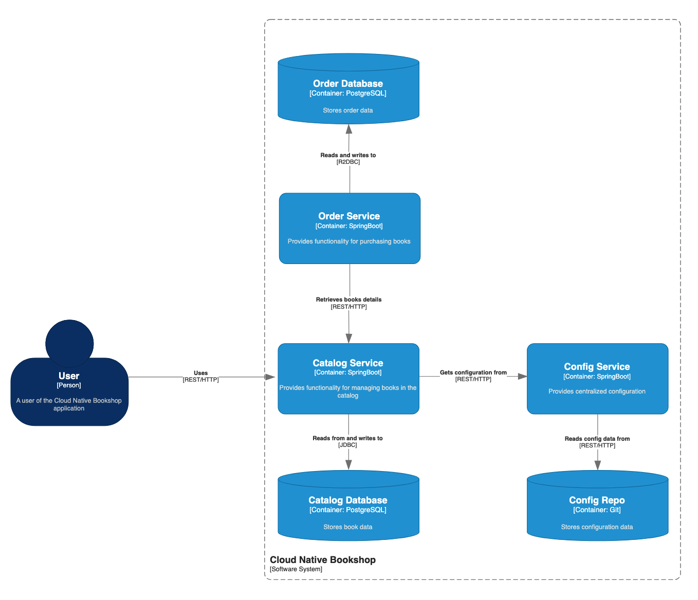

# Order Service
The order service of the Cloud Native Bookshop I'm building, while studying with Cloud Native Spring in Action.

## In This Document:
1. [System Design](#system-design)
2. [Technologies Used](#technologies-used)

## System Design

## Technologies Used
1. [Spring Boot](https://spring.io/projects/spring-boot/)
2. [Spring WebFlux](https://docs.spring.io/spring-framework/reference/web/webflux.html)
3. [Spring Data R2DBC](https://spring.io/projects/spring-data-r2dbc)

[Up](README.md)
